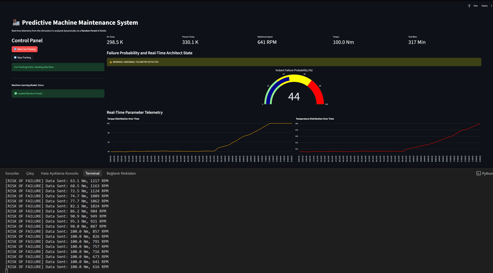
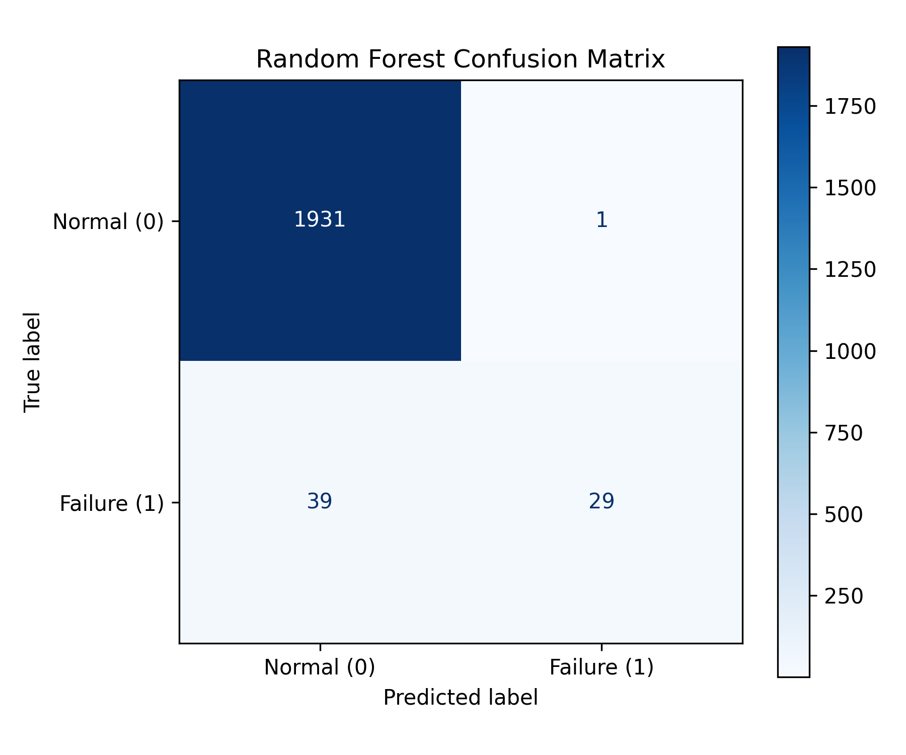
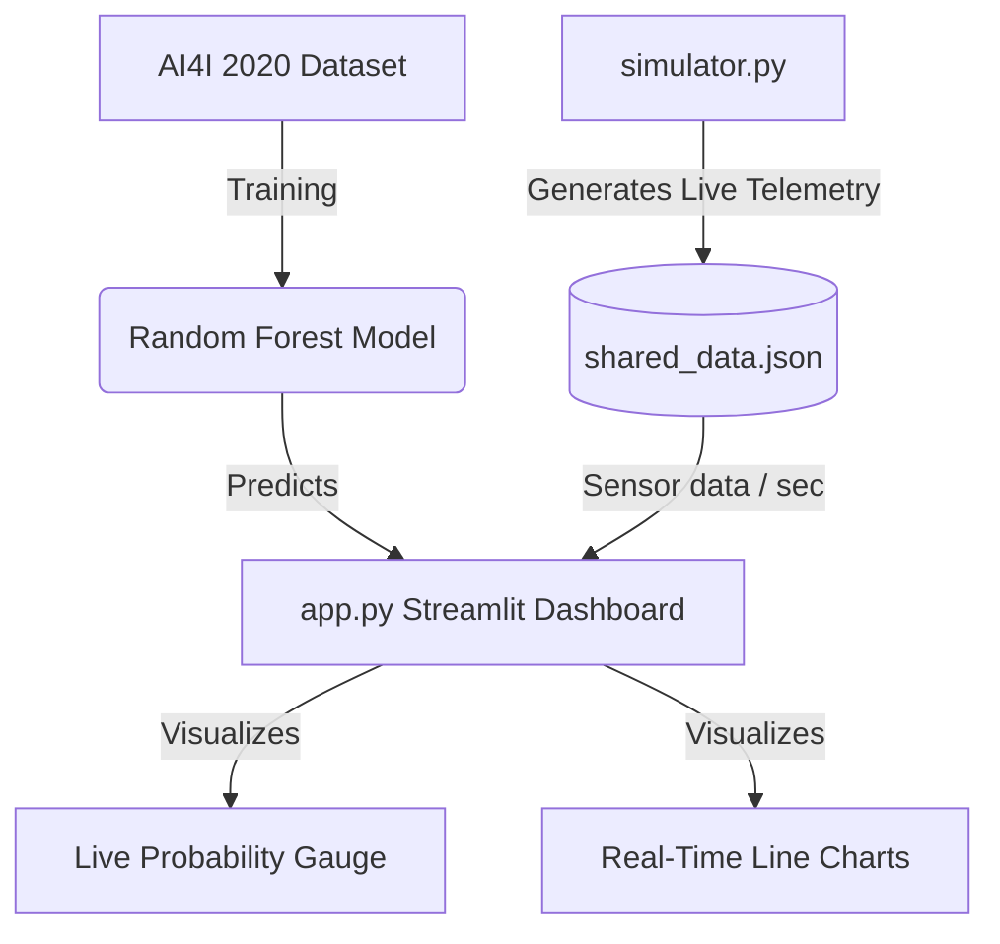
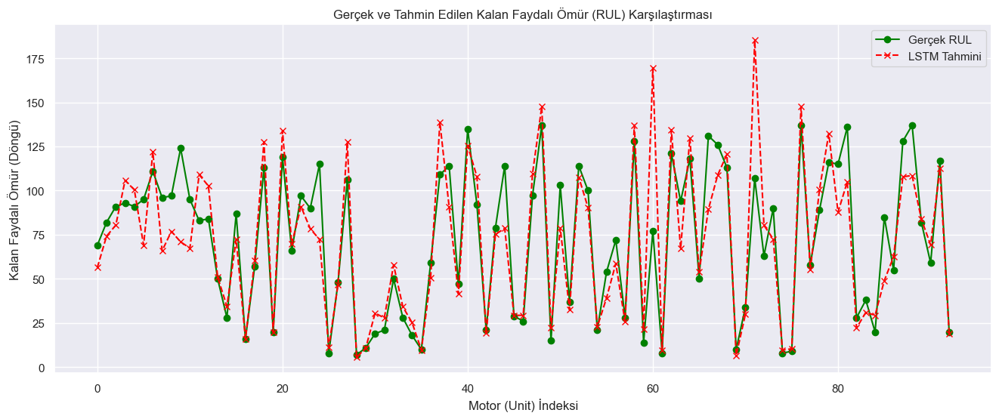

<div align="center">
  
# 🏭 AI-Assisted Industrial Equipment Health Monitoring

**A full-stack, real-time machine learning system for industrial equipment monitoring and predictive maintenance, combining Mechanical Engineering and Artificial Intelligence.**

[](https://python.org)
[](https://streamlit.io)
[](https://scikit-learn.org/)
[](https://pandas.pydata.org/)
[](https://plotly.com/)

</div>

---

## 📖 Overview

Modern industrial equipment operates under continuously changing conditions. Monitoring parameters such as rotational speed, torque, temperature, and tool wear can help identify abnormal operating conditions and support maintenance decisions.

This project develops an **AI-assisted industrial equipment health monitoring system** that simulates real-time machine telemetry and uses machine learning to detect potential equipment failures.

The system processes incoming sensor data point-by-point and provides machine health information through an interactive dashboard.

<br>

<div align="center">
  

  
</div>

<br>

---

## 🎯 Project Objectives

The main objectives of this project are:

- Monitor important industrial equipment parameters such as **Rotational Speed, Torque, Air Temperature, Process Temperature, and Tool Wear**.
- Identify abnormal operating conditions and potential equipment failures.
- Apply machine learning for **equipment failure detection**.
- Analyze equipment degradation using historical time-series data.
- Develop a foundation for **condition-based and predictive maintenance**.
- Provide an interactive dashboard for real-time equipment monitoring.

---

## 🔬 Technical Deep Dive & Code Architecture

The core architecture of this system is divided into multiple decoupled modules focusing on robust data pipelines and machine learning inference.

### 1. Machine Learning Engine (`train_model.py`)
At the core of our predictions lies the `AI4I 2020 Predictive Maintenance Dataset`.
* **Feature Engineering:** Unique identifiers and specific failure subtypes (like TWF, HDF) have been excluded to prevent target leakage. Categorical parameters like Machine Quality / `Type` (L, M, H) are transformed using `OneHotEncoder`.
* **Imbalance Handling:** In real-world data, physical failures are rare anomalies. We tackle this class imbalance using the `class_weight='balanced'` parameter within our `RandomForestClassifier` pipeline.
* **Pipeline Export:** The fully fitted `StandardScaler` and `RandomForest` are combined using `sklearn.pipeline` and serialized via `joblib` into the `models/` directory for live inference.

#### Model Evaluation & Algorithm Selection
During development, we evaluated multiple classification methods to determine the most suitable option for this specific industrial dataset. While Logistic Regression struggled to capture non-linear relationships in sensor data, **XGBoost** and **Random Forest** performed exceptionally well. We ultimately chose the Random Forest classifier because it provided the most stable **F1-Score** against the imbalanced minority class (actual failures) and reduced the risk of overfitting unseen sensor noise compared to XGBoost.

| Metric | Score | Note |
| --- | --- | --- |
| **Accuracy** | 98.0% | Overall correct prediction rate |
| **F1-Score** | 0.59 | Harmonic mean of Precision and Recall on the minority (failure) class |
| **Precision** | 0.97 | When it predicts a failure, it is correct 97% of the time |
| **Recall** | 0.43 | The ability to catch actual failures out of normal operation flow |

<br>

<div align="center">
  
  <br>
  <i>Figure 1: Confusion Matrix demonstrating the model's ability to distinguish between Normal Operation (0) and Imminent Failure (1).</i>
</div>

<br>

### 2. Live Telemetry Simulator (`simulator.py`)
To mimic a real physical PLC (Programmable Logic Controller) or SCADA system, this script acts as a continuous publisher.
* **Natural Wear Physics:** It initially generates stable parameters and then gradually injects Gaussian noise into temperature and torque profiles.
* **Anomaly Triggers:** After passing a designated epoch threshold, the machine begins to deliberately overstrain; rotational speed drops, torque spikes, and process temperature climbs rapidly.
* **Data Pipeline:** Instead of occupying network ports like UDP (which often causes disconnections in multi-threaded interface environments), it safely logs continuous JSON telemetry into `data/shared_data.json` every 1 second (1Hz).

### 3. Real-Time Inference Dashboard (`app.py`)
This central nervous system, aggregating AI inferences and raw data, is built with **Streamlit**.
* **Daemon Threads & Mutex Locks:** By default, Streamlit runs sequentially, causing the entire script to reload. To make the live data stream seamless without crashing the visualization, we designed a separate, independent `threading.Thread`. This process asynchronously reads incoming data, feeds it to the serialized `rf_model`, and caches the last 50 states using robust `threading.Lock()` controls.
* **Dynamic Visualization:** Incorporates `Plotly Graph_Objects` to draw beautifully animated gauge charts highlighting the failure probability (%) and time-series telemetry charts to pinpoint exactly *when* the physics started to degrade.



---

## 🔬 Data Science Phase: Time Series Analysis and Remaining Useful Life (RUL) Prediction

In addition to the classification module that predicts whether the machine will break down instantly, this phase of the project focuses on predicting *when* the machine will fail, known as "Remaining Useful Life" (RUL) estimation. The widely referenced **NASA CMAPSS (Turbofan Engine Degradation)** dataset is utilized for this purpose.

To achieve this, an **LSTM (Long Short-Term Memory)** deep learning model, capable of retaining past windows (time steps) of data in its memory, was trained and comparatively analyzed against a baseline *Random Forest* model.

### Model Performance Comparison and Results

* **Random Forest (Snapshot-Based):** Makes inferences by looking only at the *point-in-time* values of the sensors. It has no knowledge of the historical trend the engine has followed.
* **LSTM (Window-Based):** Learns the "degradation" trend leading to failure by keeping the past 50 cycles of sensors in its memory (Sliding Window).

**Why Does LSTM Perform Better? (In the Context of Predictive Maintenance)**
Machine wear does not happen overnight; it is a physically slow-progressing process. Temperatures rise, torque slowly becomes unbalanced. Classical machine learning algorithms like Random Forest naturally miss this temporal change and the concept of "memory" in the data. However, **LSTM** can capture Long Short-Term dependencies in the sensor data, allowing it to pinpoint exactly which degradation curve the engine is currently on with much higher accuracy.

In conclusion:
* **Fault Detection (Classification):** Fast, snapshot-based models like **Random Forest** are highly successful for detecting if the machine will fail at this exact moment.
* **Life Estimation (RUL Prediction):** **Time Series** models like **LSTM** should be used to reliably calculate *how much life* the machine has left.

<br>

<div align="center">
  
  <br>
  <i>Figure 2: Comparison of RUL (Remaining Useful Life) prediction success between LSTM and Random Forest Models, alongside sensor data trends.</i>
</div>

<br>

* 📓 **Detailed Comparative Analysis:** You can find the data preprocessing, model training, comparison metrics (RMSE, MAE), and step-by-step code implementations in the [LSTM_Comparative_Analysis.ipynb](notebooks/LSTM_Comparative_Analysis.ipynb) file.

---

## 🚀 Quick Start & Installation

Clone the repository to your local machine and install the required dependencies using Python 3.9+:

```bash
git clone https://github.com/enesuslu15/AI-Powered-Predictive-Maintenance-System.git
cd AI-Powered-Predictive-Maintenance-System
pip install -r requirements.txt
```

### Run the System

Fetch the dataset, train the model, and then launch the digital twin interface:

```bash
# 1. Prepare Data and Train the Model
python src/download_data.py
python src/train_model.py

# 2. Start the Frontend Dashboard (Terminal 1)
streamlit run src/app.py
```
*Open your Local URL (e.g., `http://localhost:8505`) from your browser as prompted. The interface will be waiting to receive live data.*

```bash
# 3. Trigger the Machine Simulator (Terminal 2)
python src/simulator.py
```
*As soon as the simulator starts, the charts on the frontend dashboard will dynamically plot the real-time telemetry.*

---

## 📁 Repository Structure
```text
Predictive-Maintenance-System/
├── data/                    # Downloaded CSV dataset and shared_data.json for real-time streaming
├── models/                  # Fully trained rf_model.joblib model parameters
├── src/
│   ├── app.py               # Streamlit Dashboard Output (Frontend Interface & Live Failure Prediction)
│   ├── download_data.py     # UCI API Dataset Fetch/Download Tool
│   ├── simulator.py         # Hardware Sensor / PLC Simulator
│   └── train_model.py       # ML Pipeline, Feature Engineering & Model Training Structure
├── requirements.txt         # Required Python libraries for the project
└── README.md                # Project documentation (this file)
```

---

## 🤝 Contributing & Licensing
We welcome your contributions, issue reports, and feature requests!
This project is open-source and available under the [MIT License](LICENSE).
